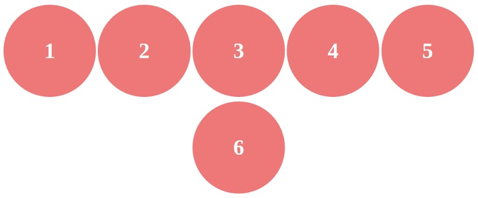
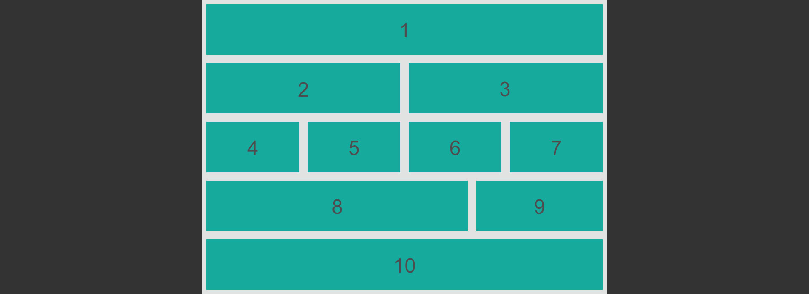
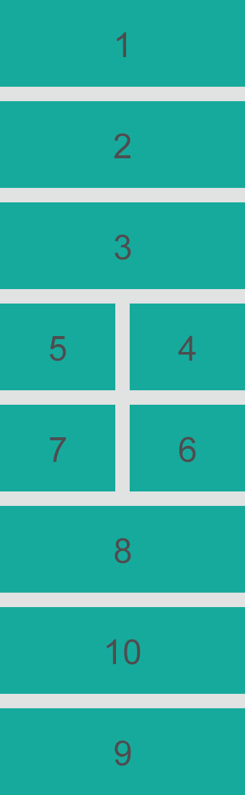

# RWD &ndash; Flexbox

> Pamiętaj, żeby oddzielać ćwiczenia komentarzami i pisać czytelny, dobrze sformatowany kod.

## Zadanie rozwiązywane z wykładowcą

### Flexbox - layout (~ 7min - 12min)

W pliku `index.html` znajdziesz element `article`. Ustaw poszczególne elementy `div` zgodnie z poniższym przykładem. Użyj flexboxa.


-------------------------------------------------------------------------------

## Zadania do samodzielnego wykonania

### Zadanie 1. Flexbox  (~ 5min - 10min)
W pliku `index.html` znajdziesz listę o nazwie `list`. Za pomocą flexboksa wykonaj następujące polecenia:
* ustaw listę o **klasie** ```list``` na środku strony.
* ustaw elementy listy obok siebie.


### Zadanie 2. Flexbox &ndash; elementy (~ 15min - 20min)
W pliku `index.html` znajdziesz sekcję o nazwie `circles`.
Użyj flexboksa do następującego ustawienia sześciu kółek:



Kółka przy mniejszej szerokości ekranu powinny automatycznie spadać pod siebie. Przykład wyżej pokazuje, że jedno kółko się nie mieści w viewporcie i dlatego spada w dół. Stwórz mixin dla prefiksów flexboksa.

### Zadanie 3. Flexbox &ndash; kolejność elementów (~ 25min - 30min)
W pliku `index.html` znajdziesz sekcję o nazwie `crazy-layout`.
Użyj flexboksa do odwzorowania poniższego layoutu. Zwróć uwagę na kolejność elementów w wersji na telefon.



Następnie dodaj breakpointy które usprawią że na telefonie (do 420px) widok będzie taki:


