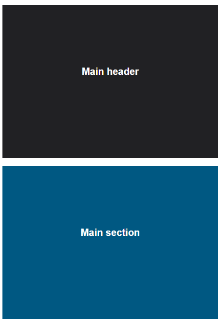
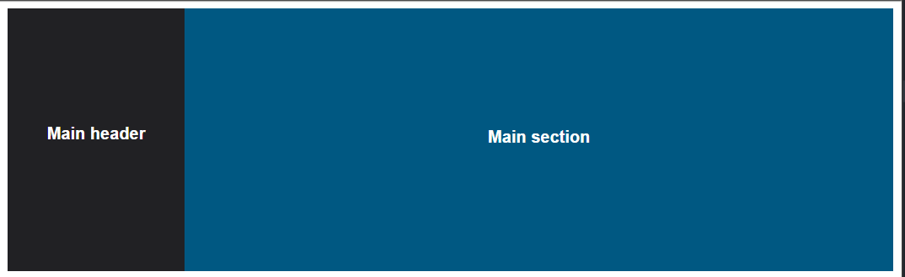

# RWD &ndash; Mobile first

> Pamiętaj, żeby oddzielać ćwiczenia komentarzami i pisać czytelny, dobrze sformatowany kod.

## Zadanie rozwiązywane z wykładowcą

### Zmiana tła  (~ 5min - 10min)

W pliku `index.html` zmień tło strony na żółte jeśli szerokość ekranu jest mniejsza niż `420px`. Użyj podejścia mobile first.

-------------------------------------------------------------------------------

## Zadania do samodzielnego wykonania

### Zadanie 1. Mixin, mobile first  (~ 15min - 20min)

W pliku `index.html` znajdziesz sekcję o klasie `container`, a w niej element `div` o klasie `sidebar` oraz element `section`.  Użyj podejścia mobile first.
Ustaw te elementy w następujący sposób:

Ekrany poniżej 600px:

Ekrany powyżej 600px:

